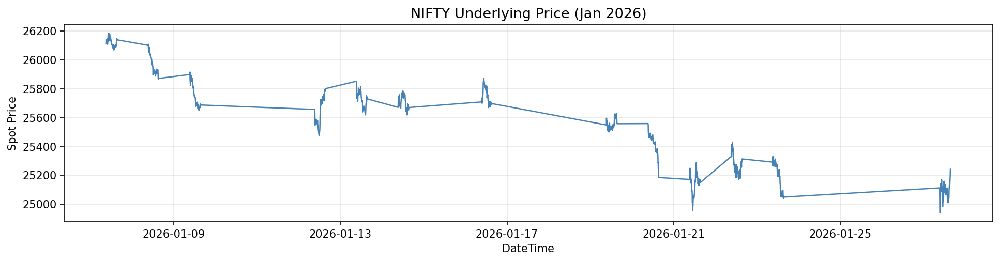
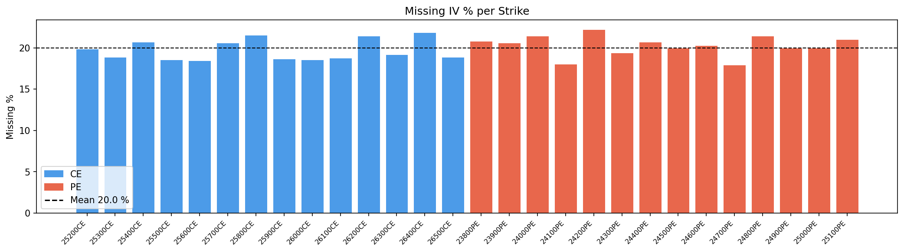
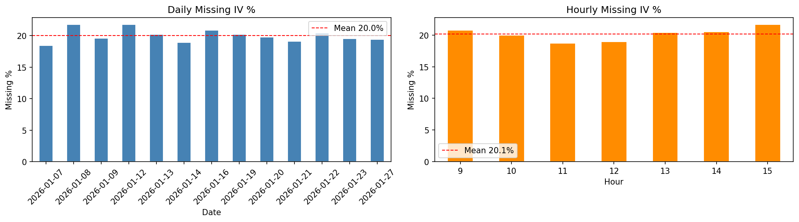
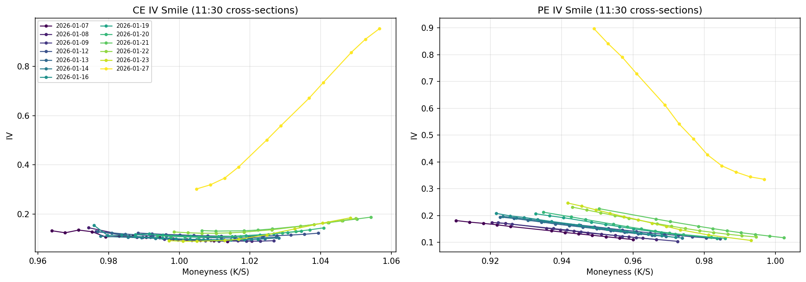
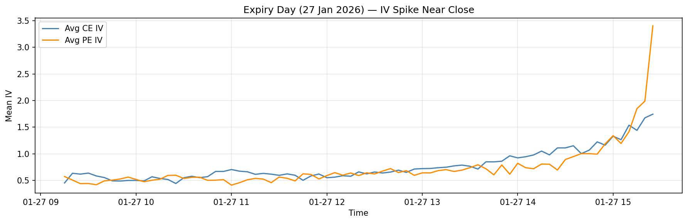
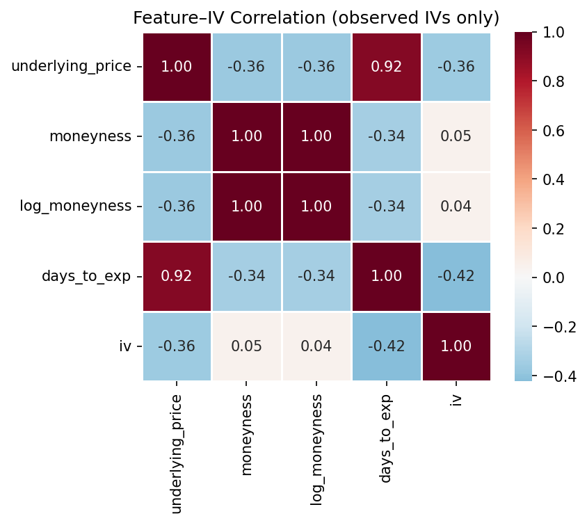
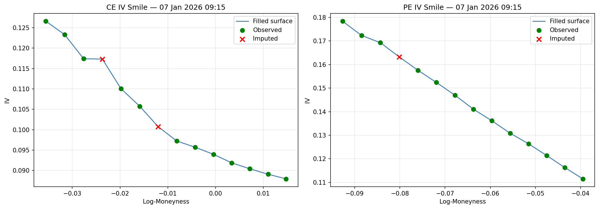
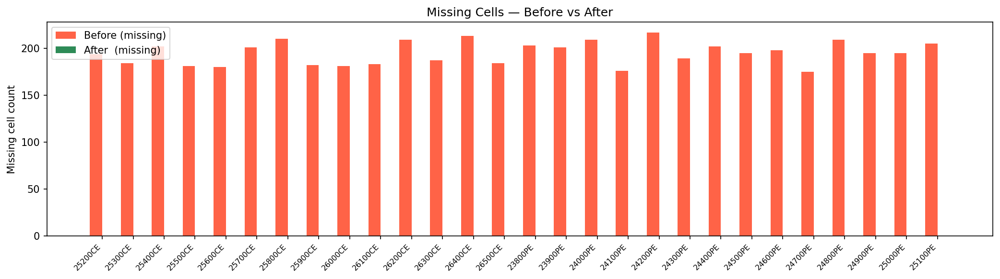
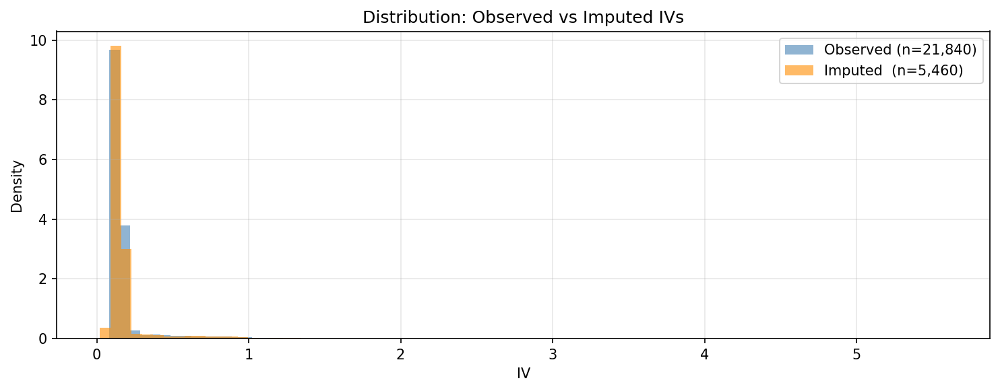

# NIFTY IV Surface Reconstruction

Reconstructing missing Implied Volatility (IV) values across a NIFTY options dataset — a competition submission for the January 2026 expiry cycle.

---

## Problem Statement

The dataset contains 975 rows × 28 IV columns (13 CE + 14 PE + 1 duplicate) covering 13 trading days (7 Jan – 27 Jan 2026) at 5-minute intervals. Approximately **20% of IV cells are missing** at random. The task is to fill every missing cell as accurately as possible.

---

## Repository Structure

```
├── nifty_iv_reconstruction.ipynb   ← Main notebook (run this end-to-end)
├── dataset.csv                     ← Original dataset with missing values (input)
├── filled_dataset.csv              ← Output: all 975 rows, no missing values
├── submission.csv                  ← Output: (id, value) pairs for missing cells only
├── eda_outputs/                    ← EDA charts saved automatically by the notebook
│   ├── 01_underlying_price.png
│   ├── 02_missing_pct_per_strike.png
│   ├── 03_daily_hourly_missing.png
│   ├── 04_iv_smile_cross_sections.png
│   ├── 05_expiry_day_iv_spike.png
│   └── 06_feature_iv_correlation.png
└── results/                        ← Post-fill validation charts
    ├── 07_filled_smile_overlay.png
    ├── 08_before_after_missing.png
    └── 09_observed_vs_imputed_dist.png
```

---

## Methodology

The reconstruction uses a two-component approach blended by weight:

### Component 1 — Cross-Sectional Weighted Polynomial (95% weight)

At each timestamp, all observed IV values for a given option type (CE or PE) are used to estimate the missing ones.

- Strikes are mapped to **log-moneyness**: `m = log(K / S_t)`
- A **Gaussian-weighted polynomial** is fitted in moneyness space, giving nearby strikes more influence
- Degree is fixed at ≤ 3; data count is checked before fitting
- For extrapolation (target strike outside observed range): 50/50 blend of polynomial + boundary linear fit
- **Zero look-ahead**: only uses same-timestamp data

### Component 2 — Intra-Day Temporal PCHIP (5% weight)

For each (strike, option type) series, PCHIP interpolation is fitted **within each trading day only** (75 rows per day).

- Using same-session neighbours is causal — a market maker would do the same
- No cross-day information leaks in
- Days with fewer than 2 observed values fall back to the cross-sectional estimate

### Blending

```
fill = (1 − α) × cross_sectional + α × temporal_PCHIP

α = 0.05   (regular days)
α = 0.10   (expiry day — higher IV volatility near close)
```

All filled values are clipped to a floor of **0.005** (0.5% IV minimum).

---

## Key Findings from EDA

| Finding | Implication |
|---|---|
| Missing rate is ~20% uniformly across all columns, days, and hours | No systematic gap pattern; random missingness assumed |
| IV smiles are smooth and well-behaved on all 13 days | Cross-sectional polynomial interpolation is appropriate |
| IV spikes dramatically near close on expiry day (27 Jan) | Expiry day needs a higher temporal blend weight |
| `days_to_expiry` has the strongest negative correlation with IV (−0.42) | Theta decay is the dominant structural driver |
| Adjacent-strike IV neighbours correlate > 0.99 with target IV | Cross-sectional approach is well-motivated |

---

## EDA Plots

### Underlying Price


### Missing IV % per Strike


### Daily & Hourly Missing %


### IV Smile Cross-Sections (11:30 each day)


### Expiry Day IV Spike


### Feature–IV Correlation


---

## Results

### Filled Smile vs Observed


### Before vs After: Missing Cell Count


### Observed vs Imputed IV Distribution


---

## Assumptions

- Each trading day contains exactly **75 rows** (09:15 – 15:25 at 5-minute intervals)
- Day index 12 (2026-01-27) is the **expiry day** — treated with higher temporal blend weight
- `NIFTY27JAN2625900CE.1` is treated as a PE-side column based on its position
- Using intra-day neighbours (same trading session) is causal and does not constitute look-ahead bias
- All filled IVs are clipped to ≥ 0.005; negative or zero IV is financially invalid

---

## How to Run

1. Clone the repo and place `dataset.csv` in the root directory
2. Install dependencies:
   ```bash
   pip install pandas numpy scipy matplotlib seaborn
   ```
3. Open and run `nifty_iv_reconstruction.ipynb` top-to-bottom
4. Outputs produced:
   - `filled_dataset.csv` — complete dataset, no missing values
   - `submission.csv` — competition submission file
   - `eda_outputs/` — all EDA charts
   - `results/` — post-fill validation charts

---

## Validation

| Check | Result |
|---|---|
| NaN values remaining | 0 |
| IV values below floor (0.005) | 0 |
| Original observed values modified | No |
| Imputed IV distribution vs observed | Closely matching |
| Smile shape after filling | Smooth and monotone |

---

## Dependencies

| Package | Purpose |
|---|---|
| `pandas` | Data loading and manipulation |
| `numpy` | Numerical operations |
| `scipy` | PCHIP interpolation |
| `matplotlib` | All visualisations |
| `seaborn` | Correlation heatmap |
